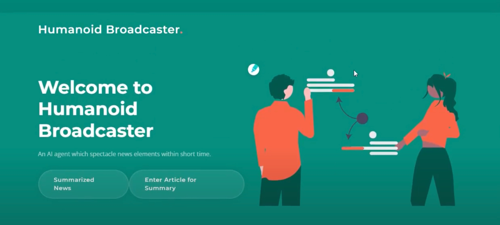

# AI-Based-Humanoid-Broadcaster 🤖📰

## Description
The AI-Based-Humanoid-Broadcaster project focuses on developing humanoid broadcasters utilizing Natural Language Processing (NLP) techniques to assist in providing summaries of news articles. With the help of this project, readers can easily obtain summarized short news articles.

## Technologies Used
- Python 🐍
- NLP (Natural Language Processing) 📝
- Data Cleaning 🧹
- Text Pre-processing 📑
- BERT (Bidirectional Encoder Representations from Transformers) 🤖
- T5 (Text-To-Text Transfer Transformer) 📝➡️📝
- Pickle (Python object serialization) 🥒
- PyTorch Lightning ⚡
- PyTorch 🔥
- TensorFlow 🧠
- Flask Framework 🌐

## Usage
This project consists of functionalities for summarizing news articles, generating headlines, and classifying news articles into different categories. Here's a brief overview of the functionalities:

### Summarization Function
The summarization function utilizes T5 model for text summarization. It takes a text input and generates a summary of the input text.

### Headline Generation Function
The headline generation function generates a headline for a given news article using the T5 model.

### Classification Function
The classification function utilizes BERT model for text classification. It classifies news articles into predefined categories such as SPORTS, BUSINESS, TRAVEL, etc.

### Input from User
The application allows users to input a text message (presumably a news article), and then it provides the summarized text, generated headline, and classification of the article based on the predefined categories.

## How to Run
1. **Clone this repository**:
    ```bash
    git clone https://github.com/your-username/AI-Based-Humanoid-Broadcaster.git
    cd AI-Based-Humanoid-Broadcaster
    ```

2. **Create a virtual environment** (optional but recommended):
    ```bash
    # For virtualenv
    virtualenv venv
    # For venv (Python 3 built-in)
    python3 -m venv venv
    ```

3. **Activate the virtual environment**:
    - On Windows:
        ```bash
        venv\Scripts\activate
        ```
    - On macOS and Linux:
        ```bash
        source venv/bin/activate
        ```

4. **Install the required dependencies**:
    ```bash
    pip install -r requirements.txt
    ```

5. **Run the Flask application**:
    ```bash
    python app.py
    ```

6. **Access the application** by navigating to `http://localhost:5000` in your web browser.

## Demo Video and Screenshots
- [Link to Demo Video](https://drive.google.com/file/d/1H6cmbNDzyYDqk570vDO0kx99w9cLUSVL/view?usp=sharing)

- 

